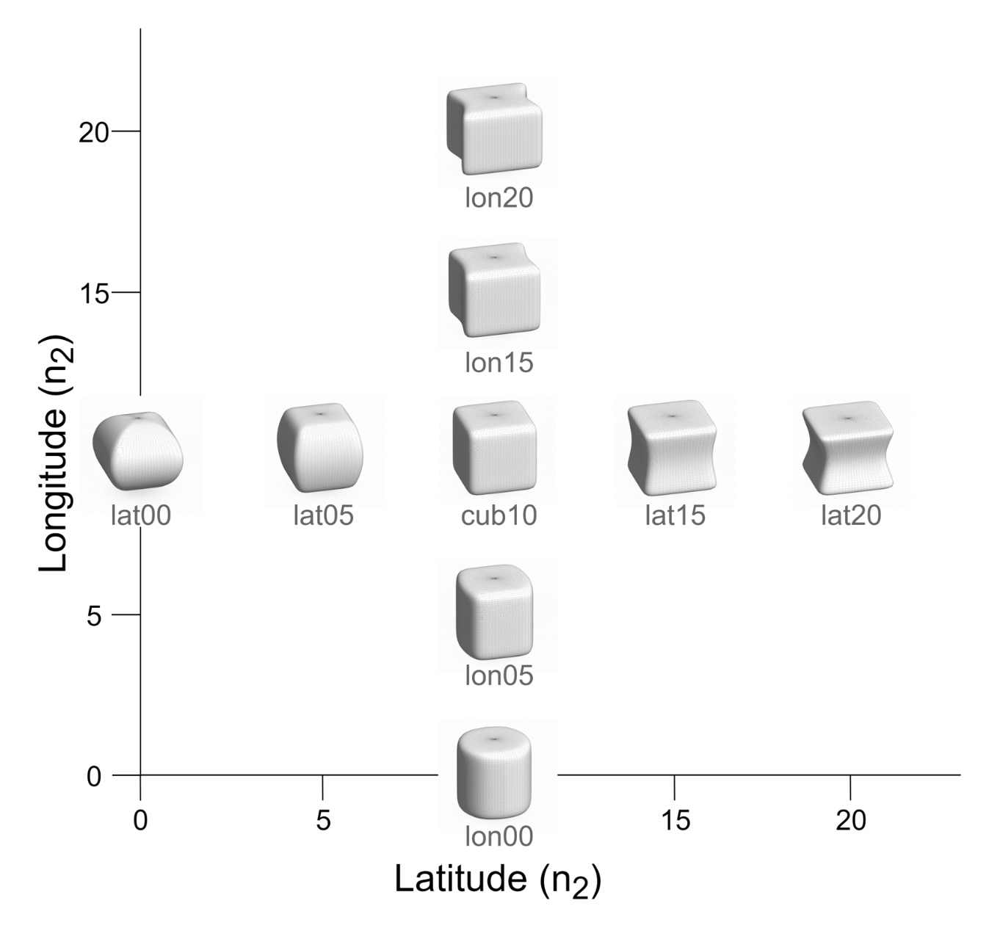
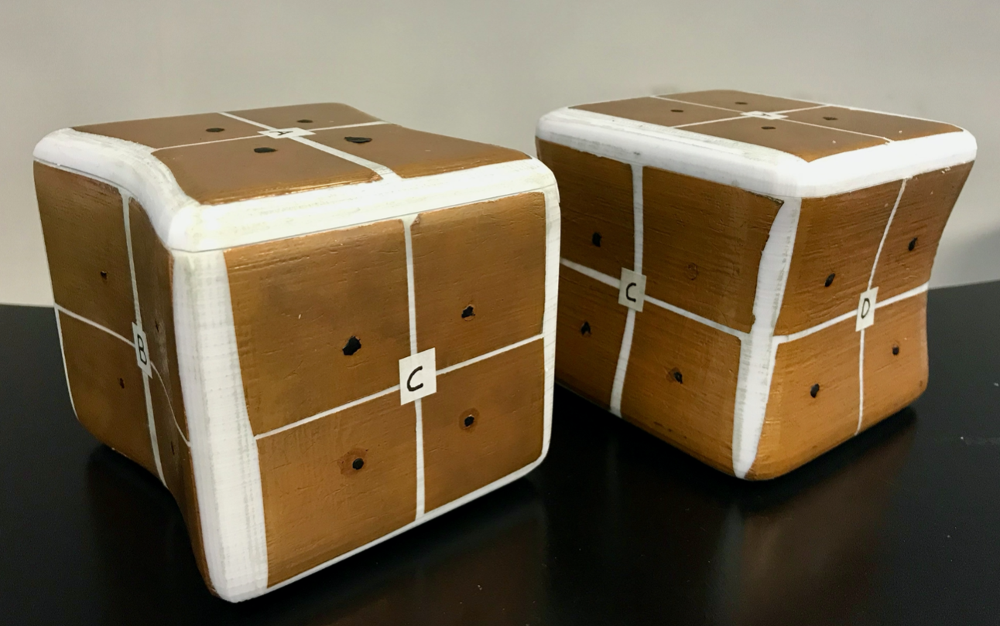

# Bayesian classifier

Naive Bayes Classifier developed with numpy. This classifier has been used in several projects to classify human tactile data. Notwithstanding that it presents excellent results with tactile data, it can also be used for other tasks to distinguish different time series.

## Dataset

Stimuli used in this experiment were modeled with the 3D extension of the Superformula (Gielis, 2003), generating a family of smoothly varying 3D shapes that were later printed. In order to capture the human haptic object manipulation, we attached twenty-four copper pads equally distributed to the surface of each object. Each pad is connected to an electronic board placed inside each object, acting as a capacitive sensor.
|Superformula 3D shapes|Haptic capture system|
|:---------------------:|:---------------------:|
|||

The electronic board placed inside the object collects data from all the sensors (touched or not touched) with a sampling frequency of 40 Hz. The sampling frequency is 40Hz. An array of 24 elements for every sample, each one being 1 (not touched) or 0 (touched), is received. Each array corresponds to one line in the text files stored in ```datasets```. We collected an independent dataset containing 20 minutes (15 for training and 5 for testing) of human haptic exploration per object. To obtain a complete exploration of the objects and to standardize haptic exploratory procedure over time, we instructed a participant to perform a task. (see [Artificial haptic recognition through human manipulation of objects](https://doi.org/10.32470/CCN.2019.1240-0) for further details)

Different publications rely on this model:

* [**Artificial haptic recognition through human manipulation of objects**](https://doi.org/10.32470/CCN.2019.1240-0)

    Object recognition has been extensively explored in the computer vision literature, and over the last few years the results in this field have sometimes even surpassed human performance. One of the main reasons for this success is the growing number of images available to generate training datasets for machine learning. In comparison to computer vision, haptic approaches to object recognition have received relatively little attention, probably due to the inadequacy of available sensors to gather the huge amount of data needed to train the modern machine learning algorithms. Consequently, the performance of machine haptic recognition of objects is still far from being comparable with humans. In this paper, we first present a new sensor system capable of capturing part of the information that humans produce during the haptic manipulation of objects and an artificial haptic intelligence that classifies shapes from the dataset created by the sensor system. Secondly, we compare the haptic object recognition performance between humans and a machine. The current study sheds new light upon the novel approach used to capture human haptic exploration and provides evidence that artificial haptic intelligence outperforms human haptic recognition abilities.

* [**Multi-modal self-adaptation during object recognition in an artificial cognitive system**](https://www.nature.com/articles/s41598-022-07424-9)

    The cognitive connection between the senses of touch and vision is probably the best-known case of multimodality. Recent discoveries suggest that the mapping between both senses is learned rather than innate. This evidence opens the door to a dynamic multimodality that allows individuals to adaptively develop within their environment. By mimicking this aspect of human learning, we propose a new multimodal mechanism that allows artificial cognitive systems (ACS) to quickly adapt to unforeseen perceptual anomalies generated by the environment or by the system itself. In this context, visual recognition systems have advanced remarkably in recent years thanks to the creation of large-scale datasets together with the advent of deep learning algorithms. However, this has not been the case for the haptic modality, where the lack of two-handed dexterous datasets has limited the ability of learning systems to process the tactile information of human object exploration. This data imbalance hinders the creation of synchronized datasets that would enable the development of multimodality in ACS during object exploration. In this work, we use a multimodal dataset recently generated from tactile sensors placed on a collection of objects that capture haptic data from human manipulation, together with the corresponding visual counterpart. Using this data, we create a multimodal learning transfer mechanism capable of both detecting sudden and permanent anomalies in the visual channel and maintaining visual object recognition performance by retraining the visual mode for a few minutes using haptic information. Our proposal for perceptual awareness and self-adaptation is of noteworthy relevance as can be applied by any system that satisfies two very generic conditions: it can classify each mode independently and is provided with a synchronized multimodal data set.

